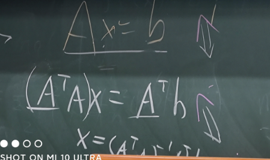
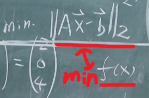
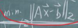

最小二乘解法等价性证明

## 题目

首先我们围观一下布置肇事题目的现场

对于最小二乘问题$Ax=b$的求解有两种方式

1转化为$(A^TA)x=A^Tb$求解

2转化为一个求最小值的问题

$min||Ax-b||_2^2$

通常用求导等于0来解决

现在假设这两种解法都正确,请证明这两种解法的等价性

## 交作业方式

在zotero group内,创建自己姓名的文件夹,然后在文件夹内上传pdf文件

{姓名}_第一次作业.pdf

可以手写然后拍照,也可以直接word电子版或markdown latex,形式不限,最终导出为pdf,直接截图一些网页上答案的话后果懂的都懂.

## 一些小提示

证明等价性,就是证明从可以推出

反过来,从推出

## 亿些小提示

这个用中文搜搜就有很多博客,比如[(15条消息) 漫步线性代数十六——投影和最小二乘_蜗牛-CSDN博客](https://blog.csdn.net/u010182633/article/details/52444135)

用英文搜就更多了,所以还是挺基本的题目.