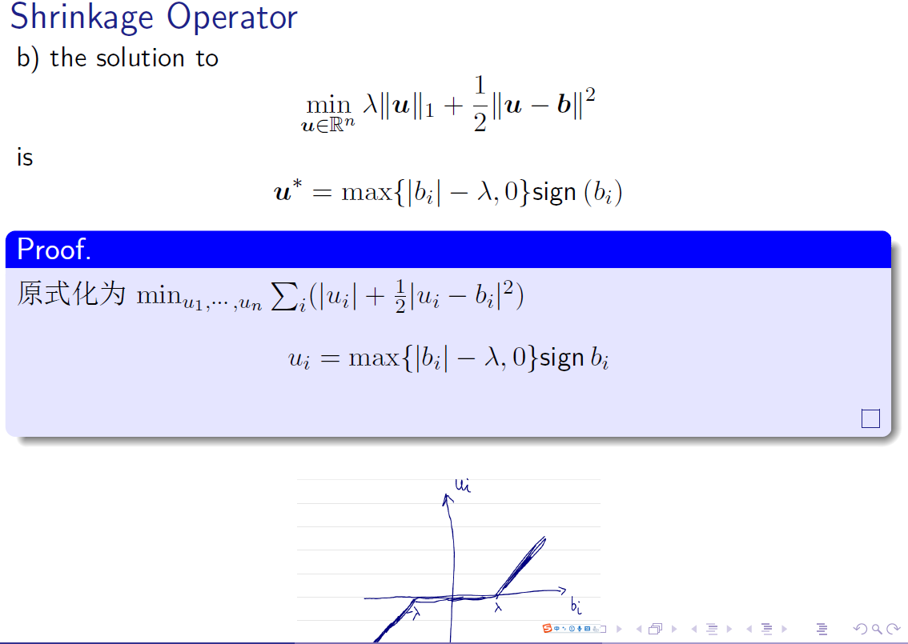
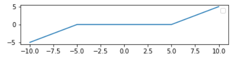

# 作业1

## 题目

First order condition for a convex function
Assume that $f$ is differentiable. dom $f$ is convex. Then $f$ is convex iff

$$f(\boldsymbol{y}) \geq f(\boldsymbol{x})+\langle\nabla f(\boldsymbol{x}), \boldsymbol{y}-\boldsymbol{x}\rangle \quad \text { for } \forall \boldsymbol{x}, y \in \operatorname{dom} f$$

## 解

$$\begin{aligned}
&f(t y+(1-t) x) \leq t f(y)+(1-t) f(x) \\
&\Longrightarrow f(x+t(y-x)) \leq f(x)+t(f(y)-f(x)) \\
&\Longrightarrow f(x+t(y-x))-f(x) \leq t(f(y)-f(x)) \\
&\Longrightarrow \frac{f(x+t(y-x))-f(x)}{t} \leq f(y)-f(x) \\
&\Longrightarrow f(y) \geq f(x)+\frac{f(x+t(y-x))-f(x)}{t}
\end{aligned}$$

let $$g(t)=f(x+t(y-x))$$

then $f(y) \geq f(x)+\frac{g(t)-g(0)}{t}$

when $t→0$,$\frac{g(t)-g(0)}{t}=g^{\prime}(t)\leq f(y)-f(x)=[介值定理]f'(a)(y-x)$where $a$ is between $x$ and $y$

when $t→0$, we have $limf'(a)=f(x)$

So $f(\boldsymbol{y}) \geq f(\boldsymbol{x})+\langle\nabla f(\boldsymbol{x}), \boldsymbol{y}-\boldsymbol{x}\rangle \quad$

# 作业2

## 题目

根据PPT中shrinkage,绘制二维的结果

绘制u关于b的图像

## 解

https://www.kaggle.com/tianyilt/shrinkage-operator-in-2d

参考王佳镐同学,感觉coding很规范,改成了标量版本

